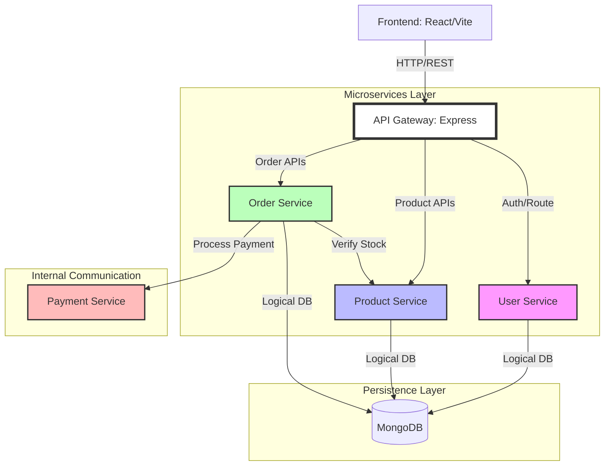

# DEPARTMENT OF COMPUTER & INFORMATION SYSTEMS ENGINEERING
## CS-432 Distributed Computing - Term Project Report
**Project Title:** TradeNexus: A Distributed Smart E-Commerce System

---

## 1. Problem Statement
In traditional monolithic e-commerce systems, all functionalities (user management, catalog, ordering, payments) reside within a single process and share a single database. This architecture faces several critical challenges:
- **Single Point of Failure:** A bug in the payment logic can bring down the entire storefront.
- **Scalability Bottlenecks:** Parts of the system that require more resources (like product search) cannot be scaled independently of less demanding parts (like user profiles).
- **Technological Rigidity:** The entire system must use the same stack, making it difficult to adopt better tools for specific tasks.

**Distributed Solution Motivation:**
A distributed microservices architecture addresses these issues by decoupling services. TradeNexus splits the platform into autonomous components that communicate over a network. This ensures **fault isolation**, **independent scalability**, and **deployment flexibility**, which are essential for modern web-scale applications.

---

## 2. Architectural Style
### Chosen Architecture: Microservices with API Gateway
We implemented a **Microservices Architectural Style** using an **API Gateway** as the central entry point.

**Key Features:**
- **Decoupling:** Each service (User, Product, Order, Payment) is responsible for a single business capability.
- **API Gateway:** Acts as a reverse proxy, handling routing, centralized authentication (JWT), and logging. It simplifies the client interface by exposing a single endpoint.
- **Inter-service Communication:** Services communicate via RESTful APIs over HTTP, ensuring language independence.

---

## 3. System Architecture Diagram


---

## 4. Sustainability & Environmental Analysis
As per **CLO-3**, we analyzed the system for environmental impact and sustainability:

- **Resource Optimization:** By using Docker containerization, we ensure high resource density. Containers share the host OS kernel, consuming significantly less RAM and CPU than traditional Virtual Machines, thus reducing the hardware energy footprint.
- **Elastic Scaling:** In a distributed environment, we only scale the services under load (e.g., scaling the Product Service during a sale). This "just-in-time" resource allocation prevents energy waste caused by idling monolithic servers.
- **Stateless Design:** Services are designed to be stateless, allowing for "Green Computing" practices where workloads can be shifted to nodes powered by renewable energy without complex state migrations.
- **Database Efficiency:** Using a NoSQL database (MongoDB) for unstructured product data reduces the computational overhead of complex relational joins, leading to lower CPU cycles per request.

---

## 5. How to Run the Project

### Prerequisites
1. **Docker Desktop**: Installed and running.
2. **Node.js**: (Optional) For running the performance benchmark script.

### Step 1: Clone and Build
Open your terminal in the project root and run:
```bash
docker compose up --build
```
This will start all 6 services (Gateway, User, Product, Order, Payment, Frontend) and the Database.

### Step 2: Accessing the Application
- **Customer Storefront**: [http://localhost:5173](http://localhost:5173)
- **API Gateway (Health Check)**: [http://localhost:4000/health](http://localhost:4000/health)

### Step 3: Administrative Features (Users & Orders)
The backend details for users and orders can be seen via the **Admin Dashboard**:
1. Register a user on the website.
2. Manually set that user's `role` to `"admin"` in the database (using MongoDB Compass).
3. Log in as that user and click the **"Admin"** button in the top navigation bar.

### Step 4: Performance Benchmarking
To demonstrate the "Load testing" extension idea:
```bash
node scripts/benchmark.js
```
This simulates concurrent traffic to the distributed system and measures latency.
